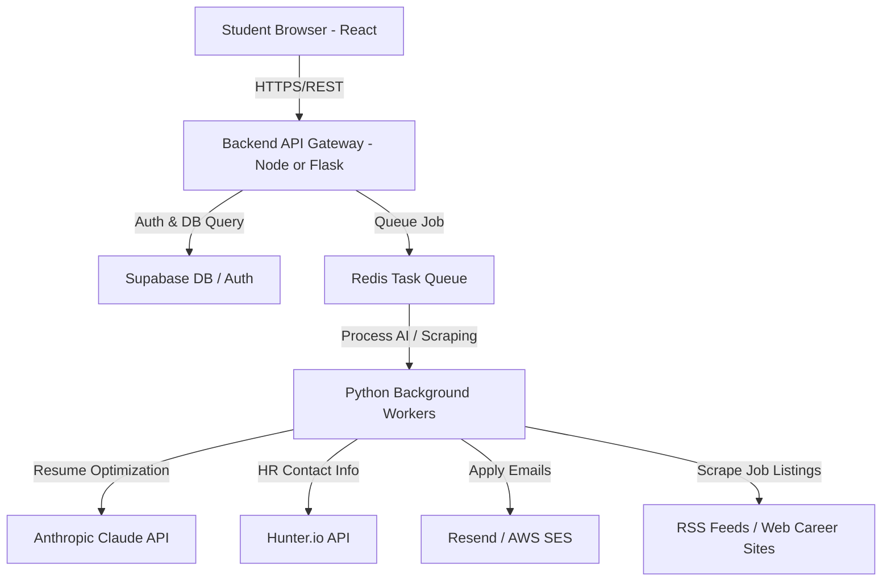

# AutoIntern Development & Implementation Guide

This guide outlines a step-by-step developer walkthrough for building **AutoIntern**, optimized to address key unit economic, API rate-limiting, and scraper-stability challenges.

We provide two implementation path choices:
1. **The Blueprint Stack:** React + Node.js (Express) + Python (FastAPI)
2. **The Unified Python Stack (Highly Recommended):** React + Python (Flask/FastAPI) — *This leverages your existing workspace's Python tools, scrapers, and Flask setup.*

---

## 1. High-Level System Architecture



---

## 2. Database Schema (PostgreSQL DDL)

Use this SQL schema to initialize your Supabase or local PostgreSQL database. It includes table-level constraints for **token caps** to prevent runaway AI costs.

```sql
-- Enable UUID extension
CREATE EXTENSION IF NOT EXISTS "uuid-ossp";

-- 1. USERS TABLE
CREATE TABLE users (
    id UUID PRIMARY KEY DEFAULT uuid_generate_v4(),
    email VARCHAR(255) UNIQUE NOT NULL,
    name VARCHAR(255) NOT NULL,
    college_id VARCHAR(100),
    plan VARCHAR(50) DEFAULT 'free' CHECK (plan IN ('free', 'pro', 'pro_plus', 'college')),
    monthly_ai_limit INT DEFAULT 10,
    ai_used_this_month INT DEFAULT 0,
    created_at TIMESTAMP WITH TIME ZONE DEFAULT CURRENT_TIMESTAMP
);

-- 2. RESUMES TABLE
CREATE TABLE resumes (
    id UUID PRIMARY KEY DEFAULT uuid_generate_v4(),
    user_id UUID REFERENCES users(id) ON DELETE CASCADE,
    raw_text TEXT NOT NULL,
    parsed_json JSONB NOT NULL, -- parsed structure: skills, experience, education, projects
    file_url VARCHAR(512),
    version INT DEFAULT 1,
    created_at TIMESTAMP WITH TIME ZONE DEFAULT CURRENT_TIMESTAMP
);

-- 3. JOBS TABLE
CREATE TABLE jobs (
    id UUID PRIMARY KEY DEFAULT uuid_generate_v4(),
    title VARCHAR(255) NOT NULL,
    company VARCHAR(255) NOT NULL,
    jd_text TEXT NOT NULL,
    source_url VARCHAR(512) UNIQUE,
    stipend VARCHAR(100),
    location VARCHAR(255),
    skills_required TEXT[],
    scraped_at TIMESTAMP WITH TIME ZONE DEFAULT CURRENT_TIMESTAMP
);

-- 4. APPLICATIONS TABLE (Enforces Tailoring Linkage)
CREATE TABLE applications (
    id UUID PRIMARY KEY DEFAULT uuid_generate_v4(),
    user_id UUID REFERENCES users(id) ON DELETE CASCADE,
    job_id UUID REFERENCES jobs(id) ON DELETE SET NULL,
    tailored_resume_text TEXT NOT NULL,
    cover_letter TEXT NOT NULL,
    status VARCHAR(50) DEFAULT 'draft' CHECK (status IN ('draft', 'applied', 'seen', 'replied', 'interview', 'offer', 'rejected')),
    sent_at TIMESTAMP WITH TIME ZONE
);

-- 5. OUTREACH LOGS TABLE
CREATE TABLE email_outreach (
    id UUID PRIMARY KEY DEFAULT uuid_generate_v4(),
    application_id UUID REFERENCES applications(id) ON DELETE CASCADE,
    to_email VARCHAR(255) NOT NULL,
    subject VARCHAR(255) NOT NULL,
    body TEXT NOT NULL,
    opened_at TIMESTAMP WITH TIME ZONE,
    replied_at TIMESTAMP WITH TIME ZONE
);
```

---

## 3. Step-by-Step Build Plan

### Phase 1: Foundation & The AI Core (Weeks 1-2)
* **Step 1.1: Database & Auth Setup**
  * Spin up a free project on **Supabase**.
  * Run the DDL script above to build your tables.
  * Configure email domain restrictions so only students with `.edu` or regional college extensions can sign up for the initial launch.
* **Step 1.2: Build the Core AI Utility (Python)**
  * Create a robust `ai_service.py` utility. We use a **hybrid LLM routing pattern** to cut down API bills:
    * Use a lightweight model (`claude-3-haiku` or `gpt-4o-mini`) to parse resumes and compute match scores.
    * Use a premium model (`claude-3-5-sonnet`) *only* to perform the final resume tailoring rewrite.

```python
import os
import json
from anthropic import Anthropic

client = Anthropic(api_key=os.environ.get("ANTHROPIC_API_KEY"))

def parse_resume(raw_text: str) -> dict:
    """Uses a lightweight model to extract structured data from raw PDF text."""
    prompt = f"""Extract structured information from this raw resume text.
    Resume Text:
    {raw_text}
    
    Return a JSON object with keys: name, email, skills (list), experience (list of dicts with role, company, bullets), education (list), projects (list of dicts with title, description, bullets). Only return valid JSON."""
    
    response = client.messages.create(
        model="claude-3-haiku-20240307", # Cheap and fast for parsing
        max_tokens=1500,
        messages=[{"role": "user", "content": prompt}]
    )
    return json.loads(response.content[0].text)

def tailor_resume(resume_json: dict, job_description: str) -> dict:
    """Uses a premium model to rewrite bullet points targeting the job description."""
    prompt = f"""You are an expert resume writer. Rewrite the bullet points in the student's resume to match the key terms and requirements of the Job Description. Keep the underlying facts true, but maximize matching relevance. Use strong action verbs.
    
    Job Description:
    {job_description}
    
    Student Resume:
    {json.dumps(resume_json)}
    
    Return a JSON object matching the input resume format but with tailored bullet points. Return ONLY JSON."""
    
    response = client.messages.create(
        model="claude-3-5-sonnet-20240620", # Premium model for high-impact writing
        max_tokens=2000,
        messages=[{"role": "user", "content": prompt}]
    )
    return json.loads(response.content[0].text)
```

---

### Phase 2: Jobs Aggregation & Scrubbing (Weeks 3-4)
* **Step 2.1: Robust Aggregator System**
  * Do not build raw web scrapers for major portals from day one (to avoid instant anti-bot blocking).
  * Use **RSS feeds** (e.g., UPWORK RSS, standard company XML maps) or **Google Jobs API** via SerpAPI to grab internship entries.
  * For local sources (e.g. Internshala), write a targeted parser that enforces a **3-second request rate limit** to avoid triggering IP blocks.
* **Step 2.2: Compute Job Match Scores**
  * For every fetched job, compare the student's parsed skills with the job description.
  * Score them from `0 to 100` and display them ordered by match score in the React dashboard.

```python
def compute_match_score(student_skills: list, job_requirements: str) -> dict:
    """Computes matching relevance score (0-100) and provides a 1-sentence reasoning."""
    prompt = f"""Compare the student's skills with the job requirements. Return a JSON object with:
    1. 'score': an integer from 0 to 100
    2. 'reason': a 1-sentence explanation of why it fits or what is missing.
    
    Student Skills: {', '.join(student_skills)}
    Job Requirements: {job_requirements}"""
    
    response = client.messages.create(
        model="claude-3-haiku-20240307", # Low-cost model is perfect for scoring
        max_tokens=300,
        messages=[{"role": "user", "content": prompt}]
    )
    return json.loads(response.content[0].text)
```

---

### Phase 3: The Application Queue & Send Flow (Weeks 5-6)
* **Step 3.1: React Application Builder Screen**
  * Create a clean UI split-pane editor:
    * **Left Side:** Job description & calculated match score.
    * **Right Side:** Tabbed view containing the **Tailored Resume** and **AI-Generated Cover Letter**.
  * Allow students to manually edit any bullet points or sentences *before* clicking send (essential for quality assurance).
* **Step 3.2: Sending and Open Tracking**
  * Use the **Resend API** to send the cold email or application packet.
  * **Open Tracking Pixel:** Embed a tiny, transparent `1x1` tracking image in the HTML body of the outgoing email pointing to your server endpoint:
    `https://api.autointern.in/track/open/<application_id>.png`
  * When the HR representative opens the email, the image request hits your server, marking the status as "Seen" in the student's Kanban board.

---

### Phase 4: Monetization Paywall & Launch Playbook (Weeks 7-8)
* **Step 4.1: Subscription Integration**
  * Integrate **Razorpay** (Standard for India) or **Stripe** (International).
  * Enforce the hard cap: Upon a user hitting **10 applications sent**, disable the "Tailor & Send" buttons and display a high-conversion checkout modal upgrading them to **Pro** (Rs. 199/month, capped at 60 AI-tailored applications/month to maintain safe token unit economics).
* **Step 4.2: Campus Go-To-Market Plan**
  * Target engineering and business colleges exactly **3 weeks prior to placement season**.
  * Establish a **Campus Ambassador Program** in one home college (give them free Pro accounts in exchange for sharing testimonial screenshots on department WhatsApp groups).
  * Build a simple viral feature: *"I applied to 20 internships in 10 minutes using AutoIntern — [referral link]"* sharing prompts for LinkedIn and Twitter.

---

## 4. Key Launch Safeguards (Self-Checklist)

- [ ] **Cap AI usage:** Ensure user plans are checked and `ai_used_this_month` is incremented on every single LLM call.
- [ ] **Protect domain reputation:** Enforce a maximum of **15 cold outreaches per user per day** to prevent ESPs (Email Service Providers) from flagging emails as spam.
- [ ] **Include Human-in-the-loop:** Always force the student to review the rewritten resume before submitting. AI can occasionally "hallucinate" minor skill nuances—manual review ensures accuracy.
- [ ] **Fail-safe scraping:** Cache scraped job listings in PostgreSQL for 24 hours so you are not hitting target boards on every user search.
