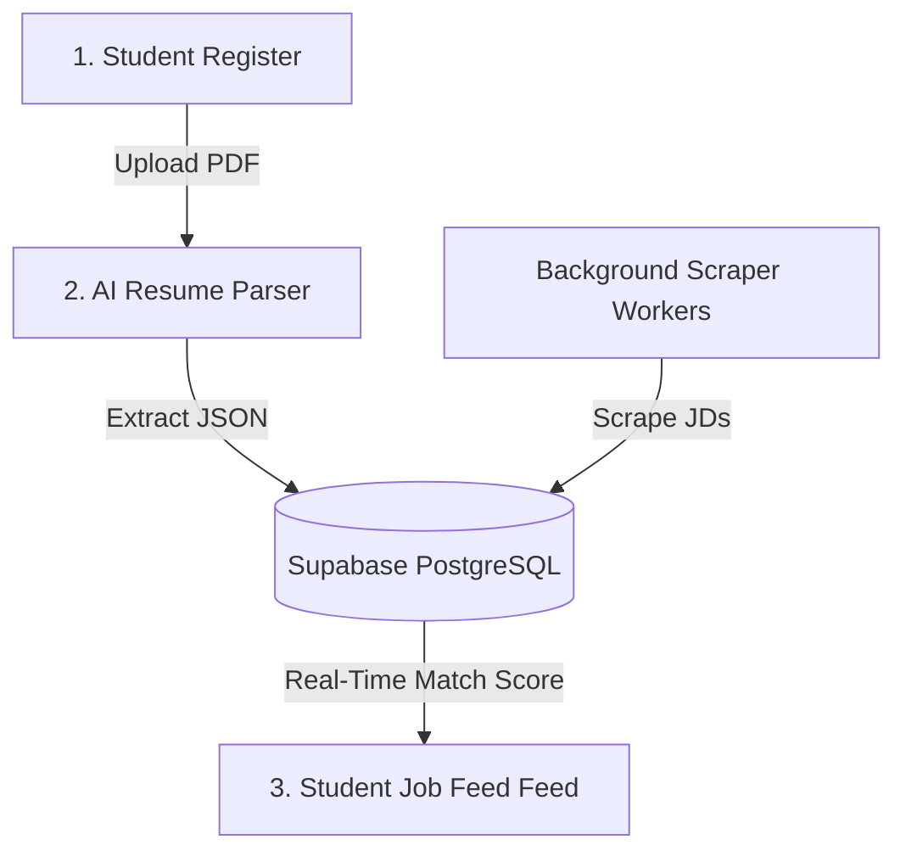
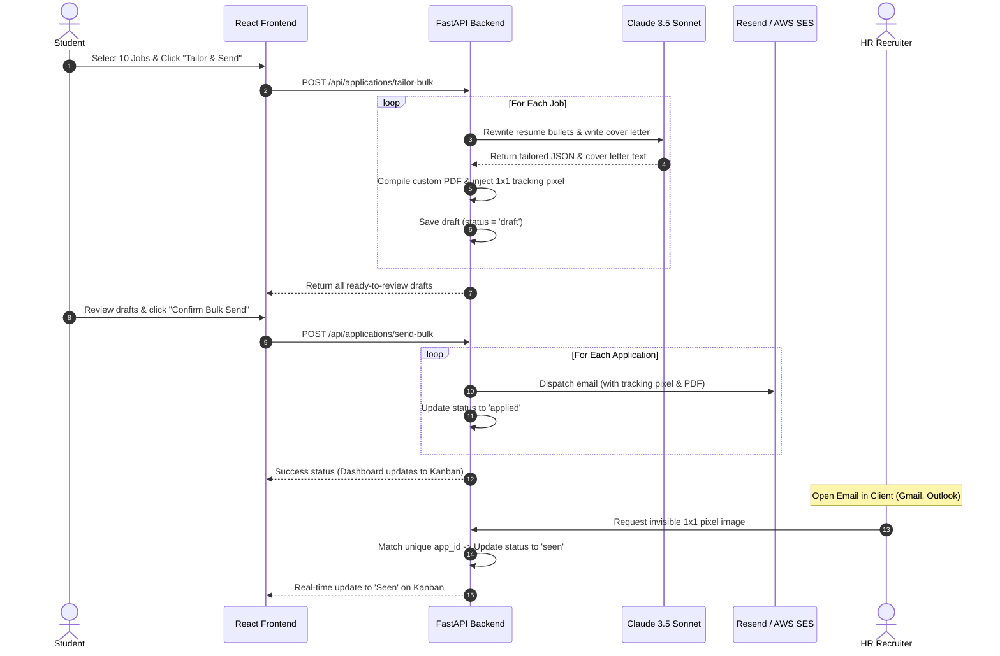
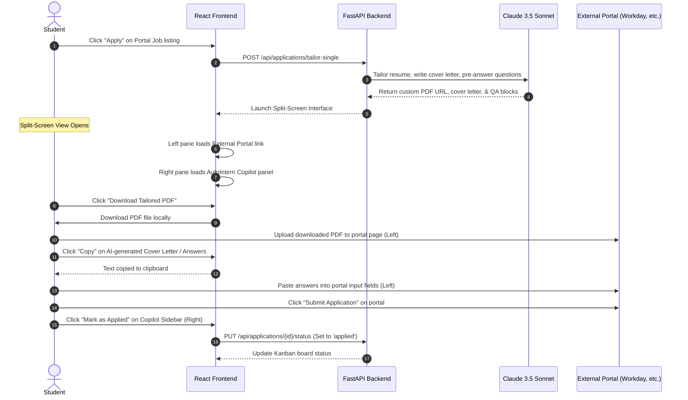

# AutoIntern End-to-End Workflow Guide

This document provides a comprehensive technical walkthrough of how **AutoIntern** works from the second a student registers, to the moment an HR recruiter opens their application. It details both **Direct Email-Based Applications** and **Portal-Based Applications** workflows.

---

## 1. System High-Level Pipeline

Regardless of the application type, every user goes through a unified entry flow:



### The Common Setup Phases:
1.  **Onboarding:** The student uploads a raw PDF/Word resume. The FastAPI backend extracts the text, sends it to `Claude-3-Haiku` to convert it into a standardized JSON profile, and writes it to the database.
2.  **Job Gathering:** A continuous scraping loop feeds the `jobs` table with internship listings from company sites and RSS feeds.
3.  **Matching:** When the student opens the job feed, FastAPI compares their skills with all available jobs in real-time, calculating a **0–100 Match Score** using a fast, low-cost AI model.

---

## 2. Workflow Type 1: Direct Email-Based Applications

This workflow is used when a job listing includes a direct email contact (e.g., small-to-mid-sized businesses or startups).

### The Technical Sequence



### Detailed Breakdown of Steps:
1.  **Selection:** The student ticks checkboxes next to 10 jobs on their feed and hits **"Tailor Selected"**.
2.  **AI Tailoring (Sonnet):** For each job, the backend sends the student’s base resume and the job description to `Claude 3.5 Sonnet`. It rewrites bullets to emphasize relevant skills (keeping the underlying facts true) and drafts a tailored cold pitch.
3.  **Pixel Injection & PDF Generation:** The backend converts the rewritten resume JSON into a clean, professional PDF file. It also creates a unique database entry for the application (`app_id`) and embeds an invisible `1x1` pixel image at the bottom of the email HTML:
    ```html
    
    ```
4.  **The Send:** The student quickly reviews the drafts, clicks **"Send All"**, and the backend fires them through **Resend** or **AWS SES** using a professional SMTP router.
5.  **Recruiter Opens (Tracking):** When the recruiter opens the email, their email client automatically fetches the invisible pixel image from our FastAPI tracking endpoint (`/track/open/app_98234.png`). 
6.  **Kanban Update:** The tracking endpoint registers the request, updates the database status of `app_98234` to `seen`, and the student's dashboard dynamically slides the card into the **"Seen"** column.

---

## 3. Workflow Type 2: Portal-Based Applications

This workflow is used when a company requires submissions through online platforms (e.g., LinkedIn Jobs, Internshala, Workday, Greenhouse).

### The Technical Sequence



### Detailed Breakdown of Steps:
1.  **Initiating Portal Apply:** The student clicks **"Apply via Portal"**. Because AutoIntern respects portal rules (to prevent student accounts from getting banned), the system runs the AI tailoring logic beforehand.
2.  **Copilot Dashboard Launch:** The frontend launches a dedicated **split-screen viewer** (or desktop helper sidebar):
    *   **Left Side (Portal):** An active iframe or browser tab loading the external job submission link (e.g., FintechCorp's Greenhouse portal).
    *   **Right Side (AutoIntern Copilot):** A side panel displaying your pre-generated assets.
3.  **Frictionless Copy-Paste Actions:**
    *   The student clicks **"Download Tailored Resume"** on the right side and drags/uploads the PDF to the portal's upload box on the left.
    *   The copilot displays pre-written responses targeting standard portal essay fields (e.g., *"Describe a time you solved a complex React problem"*). The student clicks **"Copy"** and pastes them into the portal fields on the left.
4.  **Submission Logging:** The student clicks "Submit" on the external website, then clicks **"Mark as Applied"** in the AutoIntern sidebar. The dashboard registers the application in the **"Applied"** column on the Kanban board.

---

## 4. The Unified Application Lifecycle

Every application tracked in AutoIntern moves through a structured set of states:

| Status State | Trigger Event | Action taken by the System |
| :--- | :--- | :--- |
| `draft` | Student clicks "Tailor" | AI generates materials and caches them; user can edit. |
| `applied` | Student clicks "Send" (Email) or "Mark as Applied" (Portal) | Moves card to "Applied" column; increments AI usage count. |
| `seen` | HR Recruiter opens email (triggers tracking pixel) | Dynamically slides card to "Seen" column (Email only). |
| `replied` | Recruiter replies to the outreach email | Auto-registers via incoming mail webhook; alerts user. |
| `followup_draft` | 5 days pass with zero recruiter response | Background worker auto-drafts a follow-up email in the queue. |
| `interview` | Student manually updates or AI scans scheduling link | High-priority calendar alert; provides prep suggestions. |
| `offer` / `rejected` | Student manually updates the final outcome | System aggregates data into the student's weekly analytics feed. |

---

## 5. Directory Map for Option B (FastAPI Backend)

Here is where these specific mechanics will be implemented in your backend:

*   **PDF Extraction & Formatting:** `backend/app/services/ai_service.py` -> Processes uploaded resumes.
*   **The Tracking Pixel Hook:** `backend/app/api/applications.py` -> Houses the `/track/open/{app_id}.png` route.
*   **Background Scraping Scheduler:** `backend/app/workers/tasks.py` -> Runs Celery/scheduler jobs to fetch listings.
*   **Email SMTP Router:** `backend/app/services/email_service.py` -> Coordinates the Resend API connection.
